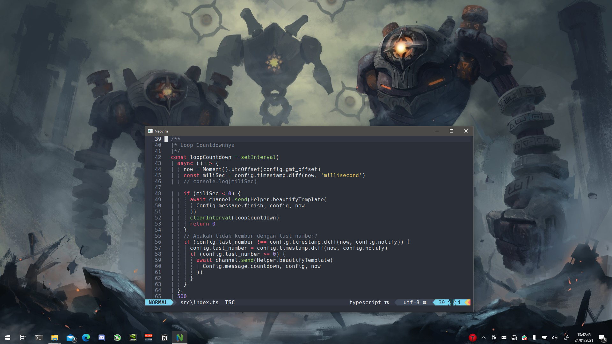
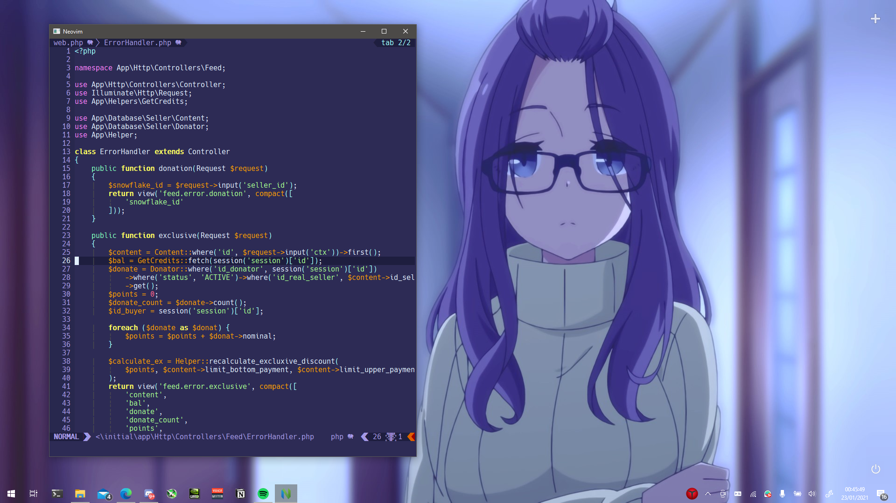

## How to install
1. Copy this file in `.config`.
2. If you using vim, rename this folder to `.vim`.
3. If you using vim, rename `init.vim` to `.vimrc`, `_vimrc`, or `vimrc`
4. Execute `:PlugInstall`
5. Execute `:CocInstall <Extension>`

## coc.vim Extension
1. coc-tsserver
2. coc-json
3. coc-html
4. coc-css
5. coc-sql
6. coc-phpls
7. coc-python
8. coc-discord-rpc
9. coc-explorer

## Theme available
You can change it in `init.vim` and restart vim/re-source `init.vim`.

- sonokai
- shades_of_purple

## Screenshot
- Sonokai

- shades_of_purple

