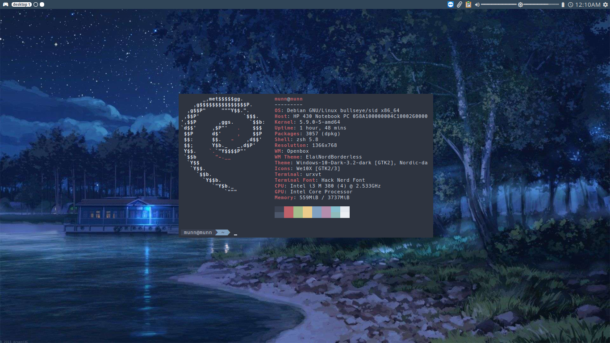
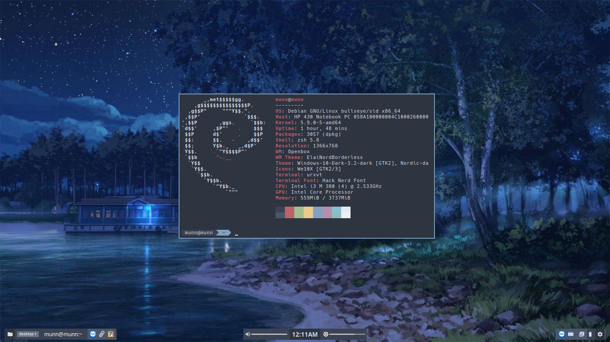

The ultimate openbox configuration here!

## Dependency (From APT/AUR)
- openbox - Window Manager
- dunst - Notification Daemon
- tint2 - Panel
- feh - Image & Background Setter
- rofi - dmenu replacement
- gsimplecal - Simple Calendar
- brightnessctl - Brightness Controller
- xfce4 - XFCE4 Tools (for Power Control)
- slock - Suckless Lockscreen
- picom - Compositor
- thunar - File Manager (alternative for Dolphin)
- papirus-icon-theme - Icon Theme
- network-manager (nmcli) - Managing Network
- mpc - Music Player Console
- mpd - Music Player Daemon
- d-feet - DBus Identifier
- xorg-xev - Key identifier
- remmina - Remote Desktop for RDP, VNC, etc
- libguestfs - Modifying virtual machine
- xclip - Clipboard
- rofi-dev
- libnotify-bin
- libimlib2-dev
- libpulse-dev
- libboost-program-options1.71-dev 
- xcfe4-goodies
- gtk2.0
- gtk3.0

## Dependency (manually install)
- xmenu - Meta Menu
- pamixer - Audio Controller
- rofi-emoji - Emoji library for Rofi
- cava - Terminal Visualizer

## How to install
1. Install all the dependency.
2. Copy all this folder and file in your home directory (`~/` or `/home/$USER`)
3. Goto `~/.config/openbox` and copy `rc.xml.default` to `rc.xml`.
4. Goto `~/.config/dunst` and copy `dunstrc-dark` to `dunstrc`.
5. Install all fonts in this root folder.
6. Logout and start openbox session.
7. Press `Meta + Alt + Enter` and choose the theme.
8. Have fun!

## Note for WSL
1. `sudo service xrdp restart` or `sudo /etc/init.d/xrdp start` to start XRDP.
2. Exchange `dolphin` with `thunar` in `~/.config/openbox/rc.xml.default`.

## Theme
- Base

- ElaiNord (elaina's [mciicrw](https://github.com/mciicrw) + nordic)

